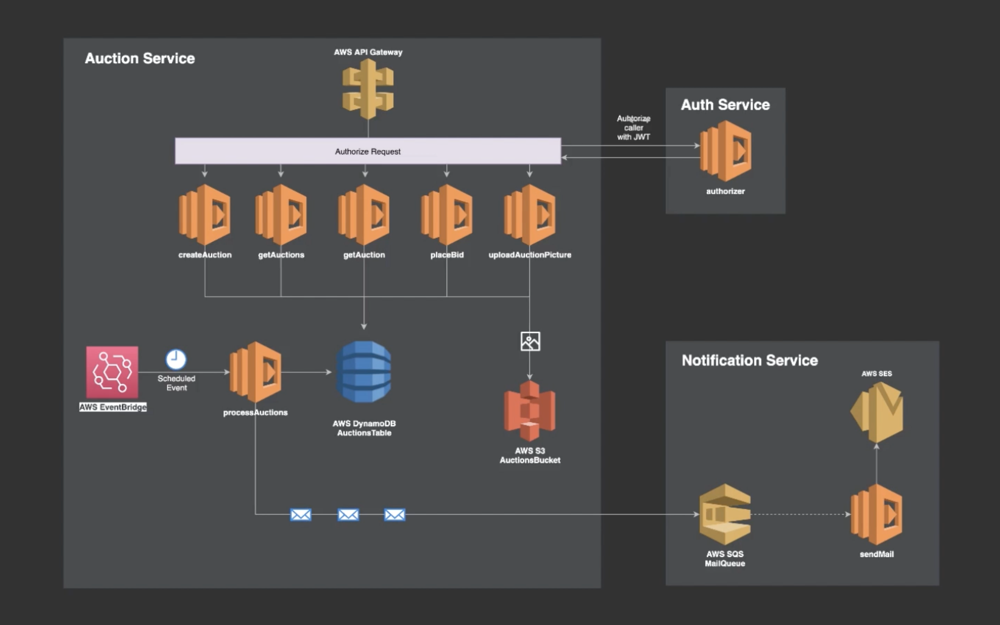

# Serverless with Nodejs and AWS

## Technologies
  - REST API and CRUD endpoints (AWS Lambda, API Gateway)
  - Data persistence (AWS DynamoDB)
  - Message Queues for cross-service communication (AWS SQS)
  - Scheduled event triggers (AWS EventBridge)
  - Cloud stack management (AWS CloudFormation)
  - Object storage on the cloud (AWS S3)
  - Email notifications (AWS SES)
  - Middleware
  - Authentication and Authorization (Lambda Authorizer)
  - Data validation and error handling
  - ... much more

## Diagram
